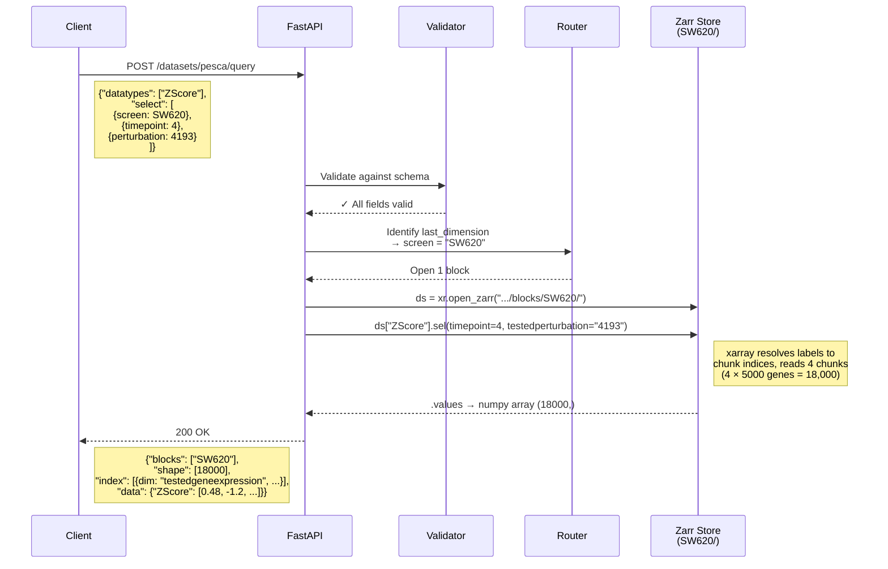
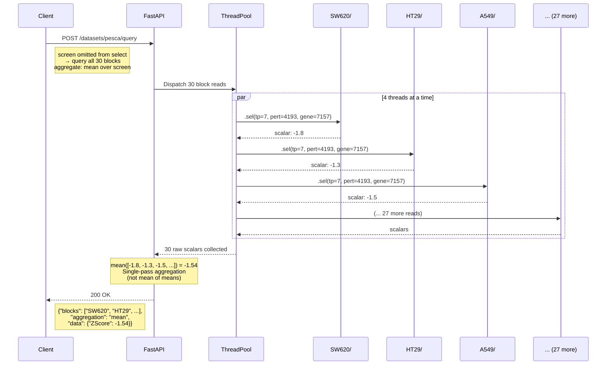
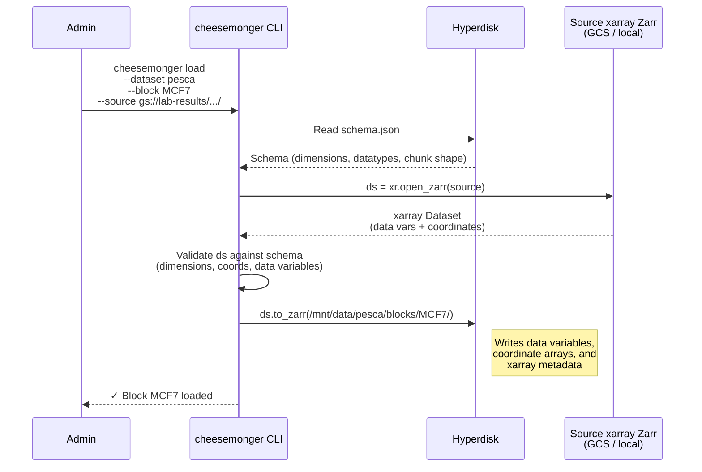

# Cheesemonger Architecture

## System Architecture

```mermaid
graph TB
    subgraph Clients
        WEB[Web App / Portal]
        PY[Python Client]
        CLI_USER[Admin CLI]
    end

    subgraph GCP VM — n4-standard-4
        subgraph FastAPI Server
            API[REST API<br/>8 endpoints]
            TP[ThreadPool<br/>4 workers]
            GM[Gene Mapping Cache<br/>entrez ↔ symbol]
        end

        subgraph Hyperdisk Balanced — 1 TB
            subgraph "/mnt/data/pesca/"
                SCHEMA[schema.json]
                subgraph "blocks/"
                    SW[SW620/]
                    HT[HT29/]
                    A5[A549/]
                    MORE[... 27 more]
                end
            end
        end

        subgraph "Each block (e.g. SW620/) — xarray Dataset as Zarr"
            Z1[ZScore/ — data variable]
            Z2[L2FC/ — data variable]
            Z3[FDR/ — data variable]
            ZN[... 12 more datatypes]
            ZC[timepoint/ testedperturbation/<br/>testedgeneexpression/<br/>— coordinate arrays]
        end
    end

    TAIGA[(Taiga<br/>Gene Mapping<br/>Source)]

    WEB -->|JSON over HTTPS| API
    PY -->|JSON over HTTPS| API
    CLI_USER -->|"cheesemonger load<br/>(Zarr → disk)"| SCHEMA

    API -->|read chunks| SW
    API -->|read chunks| HT
    API -->|read chunks| A5
    TP -.->|parallel reads| SW
    TP -.->|parallel reads| HT

    API -->|startup load| TAIGA
    TAIGA -->|DataFrame via taigapy| GM

    SW --- Z1
    SW --- Z2
    SW --- Z3
    SW --- ZN
    SW --- ZC

    style API fill:#4a9eff,color:#fff
    style TP fill:#6cb4ee,color:#fff
    style GM fill:#8ecae6,color:#000
    style TAIGA fill:#f4a261,color:#000
    style SCHEMA fill:#e9c46a,color:#000
    style SW fill:#2a9d8f,color:#fff
    style HT fill:#2a9d8f,color:#fff
    style A5 fill:#2a9d8f,color:#fff
    style Z1 fill:#264653,color:#fff
    style Z2 fill:#264653,color:#fff
    style Z3 fill:#264653,color:#fff
    style ZN fill:#264653,color:#fff
    style ZC fill:#457b9d,color:#fff
```

### Components

| Component | Role |
|-----------|------|
| **FastAPI Server** | Serves REST API, validates requests via Pydantic, reads blocks via `xr.open_zarr()` |
| **ThreadPool (4 workers)** | Parallelizes multi-block reads within a single request (each read pulls all requested datatypes) |
| **Gene Mapping Cache** | In-memory entrez ↔ symbol mapping, loaded from Taiga at startup |
| **Hyperdisk** | High-performance block storage mounted at `/mnt/data/`. Stores all Zarr data. |
| **Block (xarray Dataset as Zarr)** | One folder per screen. Contains an xarray Dataset with data variables (datatypes) and coordinate arrays (dimension labels). Written by `xarray.Dataset.to_zarr()`. |
| **Taiga** | External data platform. Source of the gene mapping file. Accessed via `taigapy`. |
| **Admin CLI** | Loads new blocks from source xarray-exported Zarr stores. Validates and copies via `xr.open_zarr()` / `.to_zarr()`. Not part of the REST API. |

---

## Query Flow

How a typical query moves through the system.

### Single-block series query

"Give me the ZScore for SW620 at day 4, perturbation MDM2 (entrez 4193)."



**Latency: ~40 ms**

### Multi-block aggregation query

"Average ZScore for TP53 (7157) response to MDM2 (4193) knockout at day 7, across all screens."



**Latency: ~300 ms** (30 blocks / 4 threads = ~8 batches × ~40 ms each)

### Data loading flow (CLI)


