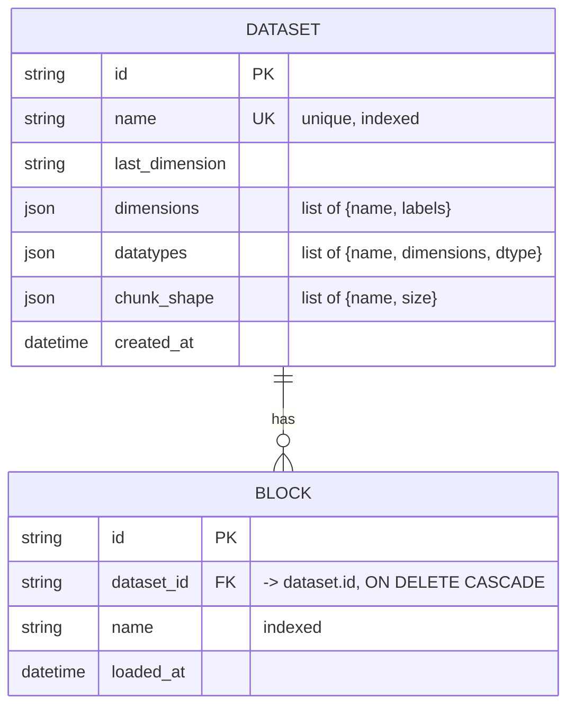

# Cheesemonger Data Model Guide

How cheesemonger models perturb-seq data — the domain concepts, the two stores
that hold them (SQLite metadata + Zarr on disk), their fields and relationships,
the invariants, and how it all maps onto queries and loading.

Companion docs: [codebase_guide.md](codebase_guide.md) (code structure),
[data_storage_design.md](data_storage_design.md) (chunking/benchmarks),
[api_design.md](api_design.md) (HTTP contract).

## Contents
1. [The big picture: two stores](#1-the-big-picture-two-stores)
2. [Domain concepts](#2-domain-concepts)
3. [Metadata model (SQLite)](#3-metadata-model-sqlite)
4. [The schema payload (JSON columns)](#4-the-schema-payload-json-columns)
5. [Data model (Zarr on disk)](#5-data-model-zarr-on-disk)
6. [How metadata and data connect](#6-how-metadata-and-data-connect)
7. [Invariants & validation](#7-invariants--validation)
8. [Worked example: perturb-scuba / PS-SC-1](#8-worked-example-perturb-scuba--ps-sc-1)
9. [Lifecycle & consistency](#9-lifecycle--consistency)
10. [Known limitations](#10-known-limitations)

---

## 1. The big picture: two stores

Cheesemonger splits a dataset into **metadata** and **data**, stored separately:

| | Store | Holds | Accessed via |
|---|---|---|---|
| **Metadata** | SQLite (SQLAlchemy) | what datasets exist, their schema (dimensions, datatypes, labels), which blocks are loaded | `crud/` layer |
| **Data** | Zarr directories on disk (a Persistent Disk in prod) | the actual N-dimensional numeric arrays | `services/query.py` + `services/loader.py` |

Why split them: metadata is small, relational, and queried constantly (validate a
request, list blocks, build a response index) — SQLite answers those in
microseconds without opening a single Zarr chunk. The data is large and
array-shaped — Zarr + xarray handle chunked, label-indexed reads. Keeping them
apart means "does block X exist?" and "what are this dataset's datatypes?" never
touch the filesystem.

---

## 2. Domain concepts

| Concept | Definition | PESCA example |
|---|---|---|
| **Dataset** | A named collection sharing one schema. | `perturb-scuba` |
| **Last dimension** | The *organizational key*. Its values are **blocks**, stored as folders — **not** an array axis. Named per dataset (default `screen`). | `screen` |
| **Block** | One value of the last dimension = one independent Zarr store on disk (one screen's data). | `PS-SC-1` |
| **Dimension** | An **array axis** inside every block, with an ordered list of coordinate **labels**. | `Timepoint`, `Target`, `Response` |
| **Datatype** | A measured quantity = one array (data variable). Each declares which dimensions it spans (may be fewer than all). | `ZScore`, `L2FC`, `FDR`, `nCtrlCells` |
| **Label** | A coordinate value along a dimension. Genes are stored as **entrez IDs (strings)**. | `Target="23293"`, `Timepoint="D4"` |
| **Chunk shape** | Intended Zarr chunk sizes per dimension (storage/perf tuning). | `[]` (auto) |
| **Gene mapping** | Separate entrez↔symbol lookup (from Taiga), served for client-side translation. Not part of any dataset row. | — |

The pivotal idea: **the last dimension is a folder, not an axis.** A query
*refers* to it like any dimension (`screen="PS-SC-1"`), but resolving it means
"open that block's folder," whereas resolving `Timepoint="D4"` means "slice the
array." This is what makes adding/deleting a screen an O(1) folder + one DB row,
never a rewrite of a big array.

---

## 3. Metadata model (SQLite)

Two tables (`models/dataset.py`). Both use a string UUID primary key (`UUIDMixin`).



**`dataset`**

| Column | Type | Notes |
|---|---|---|
| `id` | str (UUID) | primary key |
| `name` | str | **unique**, indexed — the dataset name |
| `last_dimension` | str | the organizational-key name (e.g. `screen`) |
| `dimensions` | JSON | list of `{name, labels}` (see §4) |
| `datatypes` | JSON | list of `{name, dimensions, dtype}` |
| `chunk_shape` | JSON | list of `{name, size}` (may be empty) |
| `created_at` | datetime (tz-aware) | set on insert |

**`block`**

| Column | Type | Notes |
|---|---|---|
| `id` | str (UUID) | primary key |
| `dataset_id` | str (FK) | → `dataset.id`, `ON DELETE CASCADE` |
| `name` | str | indexed; the block/screen name |
| `loaded_at` | datetime (tz-aware) | set on insert |

**Constraints & relationships**
- `UniqueConstraint(dataset_id, name)` — a block name is unique *within* a dataset (two datasets may both have a `SW620`).
- `Dataset.blocks` is a relationship with `cascade="all, delete-orphan"`; combined with the FK `ON DELETE CASCADE` (and `PRAGMA foreign_keys=ON`), deleting a dataset removes its block rows.
- The block row records only that a block **exists** (name + when loaded). The actual arrays live on disk (§5); there are no per-cell rows.

**Why JSON columns for dimensions/datatypes/chunk_shape?** They're nested,
read/written as a unit, and a dimension can carry 50k+ labels — modeling each
label as a row would be millions of rows for zero query benefit. They're
effectively a document embedded in the dataset row.

---

## 4. The schema payload (JSON columns)

The three JSON columns store Pydantic models (`schemas/common.py`), dumped to
plain dicts. Shapes:

**Dimension** — one array axis and its ordered labels.
```json
{"name": "Timepoint", "labels": ["D4", "D7"]}
```
- `name`: `SafeName` (see §7).
- `labels`: `list[int] | list[str]`, ≤ 50,000. Order is the array's coordinate order.

**DatatypeSpec** — one measured array and the dimensions it spans.
```json
{"name": "ZScore", "dimensions": ["Timepoint", "Target", "Response"], "dtype": "float32"}
```
- `dimensions` is a subset of the dataset's dimension names, in array order. A datatype may span **fewer** dimensions than the full set (a "reduced-rank" datatype, e.g. `nCtrlCells` over just `["Timepoint"]`).
- `dtype` defaults to `"float32"`.

**ChunkDim** — an intended chunk size for one dimension.
```json
{"name": "Response", "size": 5000}
```
- Omitted dimensions default to their full extent. An empty list means "no explicit chunking." (See §10 — the loader currently rechunks to dask `auto` rather than honoring this.)

**API-facing views** (`schemas/dataset.py`) reshape the same data for responses:
- `DimensionInfo` adds `size`; for dimensions with > 100 labels it returns `labels_truncated=True` + a `labels_sample` (first 5) instead of the full list, to keep responses small.
- `BlockInfo` = `{name, loaded_at}`.
- `DatasetDetail` = the whole schema + blocks; `DatasetSummary` = `{name, blocks, datatypes}` counts for the list endpoint.

---

## 5. Data model (Zarr on disk)

Each **block** is an independent xarray-exported Zarr store:

```
{data_dir}/
  {dataset}/                         e.g. perturb-scuba/
    blocks/
      {block}/                       e.g. PS-SC-1/   (one screen)
        zarr.json / .zmetadata       group metadata
        {datatype}/                  e.g. ZScore/    (one data variable)
          zarr.json                  array metadata (dtype, shape, chunks)
          c/…                        chunk files
        {dimension}/                 e.g. Response/  (coordinate array)
          …
        .zattrs                      xarray dims metadata (_ARRAY_DIMENSIONS)
```

- Written by `xarray.Dataset.to_zarr()`, so dimension names and coordinate labels are embedded in the store (xarray reads them back with `.sel()` label indexing — no manual index math).
- **The last dimension is not present here** — it's the folder name (`PS-SC-1`), one level up.
- Each datatype is its own array; each dimension is a coordinate array. A block’s arrays all share the block's dimension labels.
- On load, cheesemonger **rechunks** the store (dask `auto`, ~128 MB chunks) and strips the source's chunk encoding, so a pathologically over-chunked delivery (100k+ tiny files) collapses to a handful of chunks. See [data_storage_design.md](data_storage_design.md).

---

## 6. How metadata and data connect

A query uses **both** stores; understanding the split explains the whole system.

```
POST /datasets/perturb-scuba/query
  select: screen=PS-SC-1, Timepoint=D4, Target=23293   datatype: ZScore
```

1. **SQLite** (`crud.get_schema_dict`) → the schema dict. Used to *validate*
   (is `ZScore` a datatype? is `Timepoint` a dimension? is the aggregate legal?)
   and to know the `last_dimension` name.
2. **SQLite** (`crud.list_block_names`) → the blocks; confirms `PS-SC-1` exists.
3. The selection is split:
   - `screen=PS-SC-1` matches `last_dimension` → **folder routing**: open `{data_dir}/perturb-scuba/blocks/PS-SC-1`.
   - `Timepoint=D4`, `Target=23293` → **array selection**: `da.sel(...)` on the Zarr.
4. **Zarr** returns the `Response` vector.
5. The response **index labels** come from the **SQLite** schema
   (`dimensions[*].labels`), not from the block's Zarr coordinate arrays.

That last point is the key coupling — and the source of the per-block-coords
limitation in §10: labels are modeled once at the dataset level, even though each
block physically has its own coordinate arrays.

| Question | Answered by |
|---|---|
| Does this dataset/block exist? What are its datatypes/dimensions? | SQLite |
| Which folder holds block X? | derived: `{data_dir}/{dataset}/blocks/{block}` (sanitized) |
| What are the actual numbers? | Zarr on disk |
| What labels does the response index use? | SQLite schema (dataset-level) |

---

## 7. Invariants & validation

Enforced at dataset creation (`api/datasets.py`) and by the schema types:

- **Names are `SafeName`** — `^[A-Za-z0-9][A-Za-z0-9_\-]*$`, ≤128 chars. Applies to dataset, block, dimension, datatype, and chunk-dim names. No slashes/dots ⇒ no path traversal. Leading digits allowed (cell-line names like `22Rv1`). Enforced on request bodies (Pydantic → 422) and at filesystem path construction (`services/dataset.py` → `InvalidName` → 400). See [codebase_guide.md §15](codebase_guide.md#15-name-sanitization).
- **`last_dimension` must not appear in `dimensions`** — it's a folder key, not an axis.
- **Every `datatype.dimensions` entry must be a declared dimension.**
- **No dimension may have empty `labels`.**
- **Uniqueness** — dataset `name` is globally unique; block `name` is unique per dataset.
- **Size caps** — ≤ 20 dimensions, ≤ 50,000 labels/dimension, ≤ 100 datatypes.
- **Not enforced (by design):** per-block label agreement. Different blocks may carry different `Target`/`Response` label sets; the loader validates dimension/datatype *names* against the schema but not labels.

---

## 8. Worked example: perturb-scuba / PS-SC-1

**`dataset` row**
```json
{
  "name": "perturb-scuba",
  "last_dimension": "screen",
  "dimensions": [
    {"name": "Timepoint", "labels": ["D4", "D7"]},
    {"name": "Target",    "labels": ["23293", "55149"]},
    {"name": "Response",  "labels": ["10", "100", "…", "9997"]}
  ],
  "datatypes": [
    {"name": "ZScore",     "dimensions": ["Timepoint", "Target", "Response"], "dtype": "float32"},
    {"name": "L2FC",       "dimensions": ["Timepoint", "Target", "Response"], "dtype": "float32"},
    {"name": "FDR",        "dimensions": ["Timepoint", "Target", "Response"], "dtype": "float32"},
    {"name": "nCtrlCells", "dimensions": ["Timepoint"],                        "dtype": "int32"}
  ],
  "chunk_shape": []
}
```
(`nCtrlCells` shown as a reduced-rank datatype — spans only `Timepoint`.)

**`block` rows**: `{name: "PS-SC-1", dataset_id: <perturb-scuba id>}`, one per screen.

**On disk**
```
/mnt/data/perturb-scuba/blocks/PS-SC-1/
  ZScore/  L2FC/  FDR/  nCtrlCells/  …        ← data variables
  Timepoint/  Target/  Response/              ← coordinate arrays
```

**A query** `screen=PS-SC-1, Timepoint=D4, Target=23293, datatype=ZScore` →
open `…/blocks/PS-SC-1`, `ds["ZScore"].sel(Timepoint="D4", Target="23293")` →
a `Response`-length vector, indexed by the `Response` labels from SQLite.

---

## 9. Lifecycle & consistency

**Create dataset** → insert `dataset` row + `mkdir …/blocks/` → commit.
**Load block** → validate/infer schema, write the Zarr dir (rechunked), insert
`block` row → commit.
**Query** → read metadata (SQLite) + arrays (Zarr).
**Delete block** → delete `block` row + `rmtree` its dir → commit.
**Delete dataset** → refuse if blocks remain (409); else delete row (cascades) +
`rmtree` dataset dir → commit.

**Two-store consistency.** SQLite and the filesystem can't share a transaction,
so ordering is chosen to fail safe: data is written to disk *before* the DB row
is committed, and DB rows are deleted *before* the directory is removed. The
residual risk is an **orphaned Zarr directory** (data on disk with no `block`
row) if a process dies between the write and the commit — surfaced as wasted
disk, never as a phantom block in query results (queries enumerate blocks from
the DB). A reconcile/cleanup step is a future item (§10).

---

## 10. Known limitations

Tracked in [planning.md](planning.md):

- **Per-block coordinate labels (`TODO(per-block-coords)`).** Labels are modeled
  once at the dataset level, but blocks legitimately differ (e.g. each screen's
  `Response` set). The response index uses the dataset-level labels, which can be
  wrong for a block whose coordinates differ.
- **Broadcasted form required.** The query engine applies every fixed-dimension
  selection to each datatype, so it needs the "broadcasted" store (every datatype
  spans all selected dims). Reduced-rank datatypes are representable in the model
  but a query that fixes a dimension they lack is rejected until
  `TODO(unbroadcast)` lands.
- **`chunk_shape` not yet honored (`TODO(rechunk)`).** The column exists and is
  returned, but the loader rechunks to dask `auto` rather than to the declared
  chunk shape.
- **Orphaned directories.** No reconcile step yet for data-on-disk-without-a-row
  (see §9).
